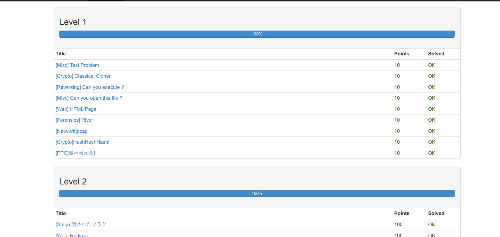

# CTF2026 課題リポジトリ

このリポジトリは授業課題として作成した CTF・サーバ構築の成果物をまとめたものです。

---

## 1. cpawCTF

- 課題リンク  
  https://github.com/omas-public/lecture2025/blob/main/references/CTF/cpawCTF.md

- スクリーンショット  
  

---

## 2. Web / FTP / Telnet サーバ構築課題

以下のサーバ構築および設定を行った。

---

### Webサーバ（Apache + Basic認証）

- マニュアル：web.md
  [Webサーバマニュアル](web.md)
- 内容：
  - Apacheインストール
  - Webサーバ起動
  - Basic認証設定（Apache設定ファイル方式）

---

### FTPサーバ（vsftpd）

- マニュアル：ftp.md
  [FTPサーバマニュアル](ftp.md)
- 内容：
  - vsftpdインストール
  - サービス状態確認
  - FTPサーバ起動
  - ポート21確認

---

### Telnetサーバ

- マニュアル：telnet.md
  [Telnetサーバマニュアル](telnet.md)
- 内容：
  - telnetdインストール
  - inetd（inetutils-inetd）設定
  - ポート23確認
  - ログイン動作確認

---

## 3. リポジトリリンク

https://github.com/itc-n25012/ctf2026

---

## 4. 補足

- 各サーバはLinux上で動作確認済み
- WebサーバはBasic認証によりアクセス制御を実装
- FTP / Telnetはローカルネットワークで動作確認済み
